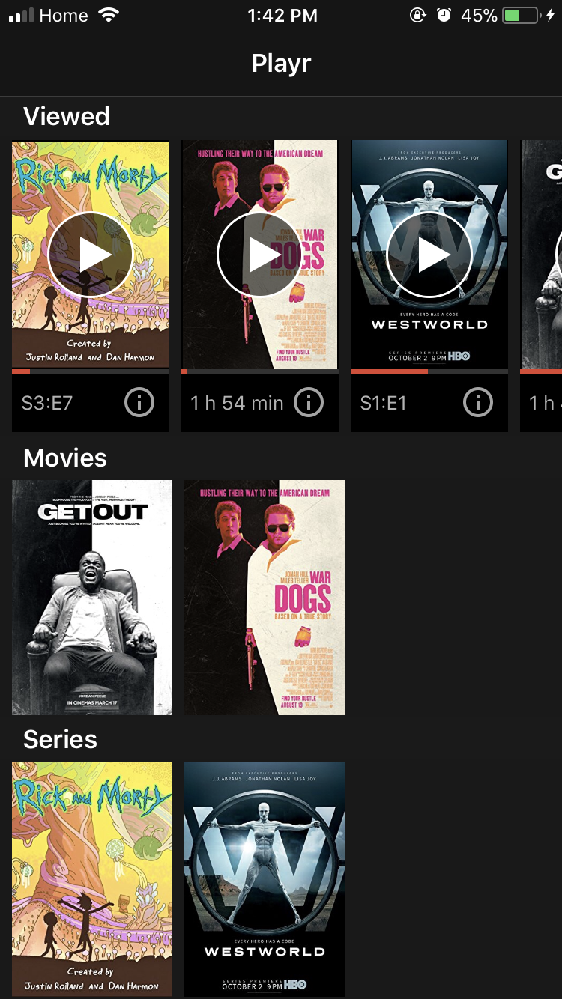
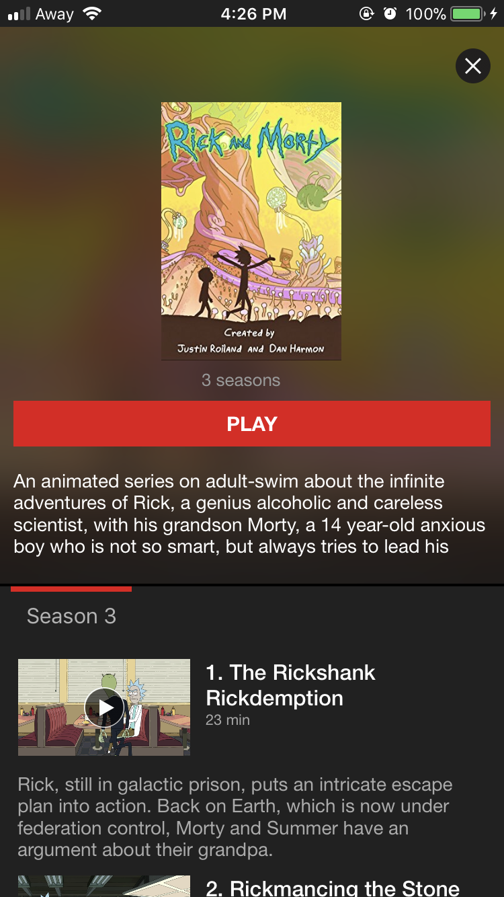
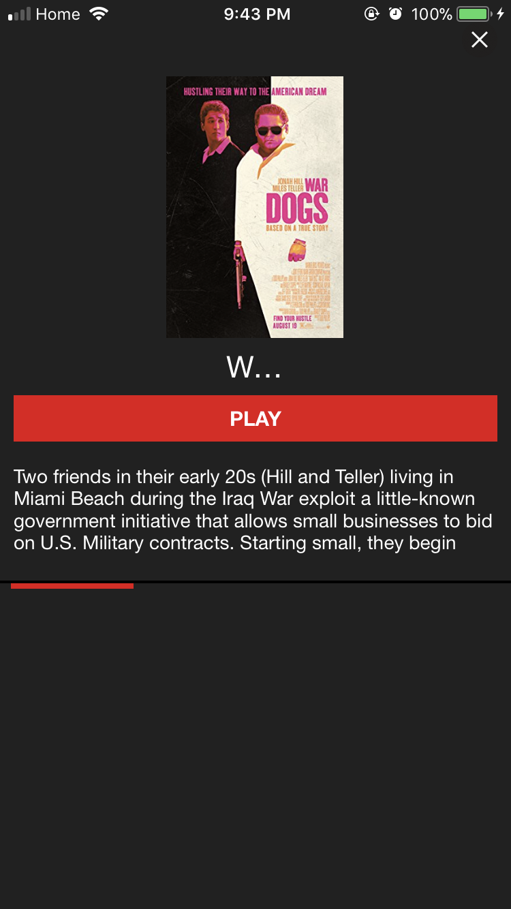
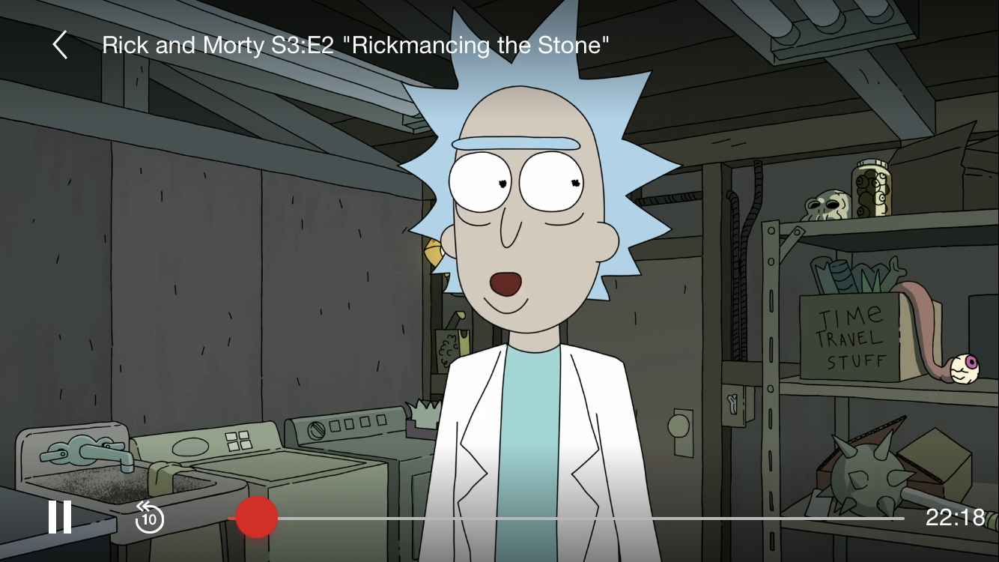
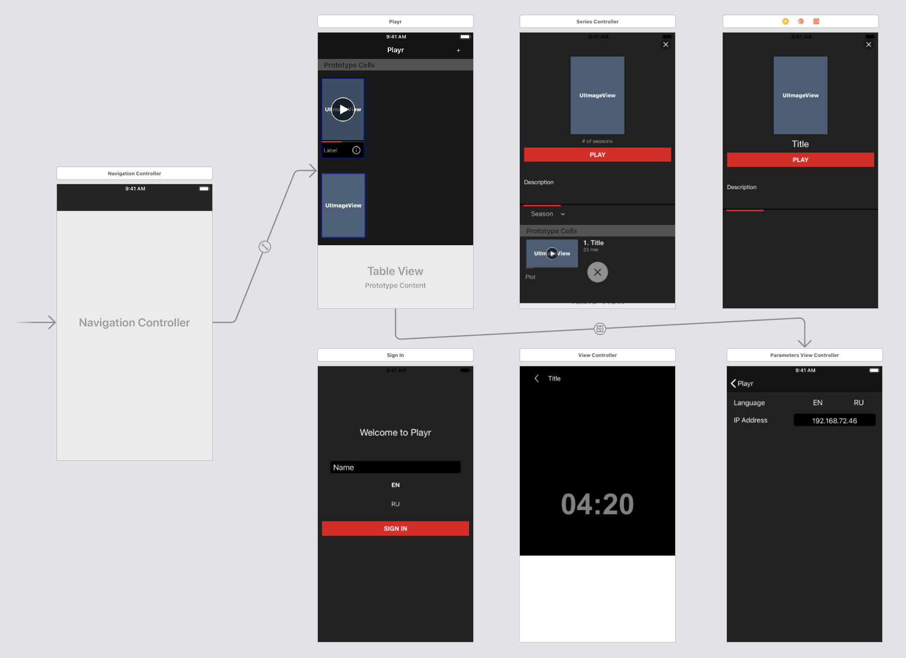

#  PLAYR

  An app that lets you and your family view videos/movies from your local server (tested on iPhone 8).
  For more information <a href="http://www.balamou.com/playr">balamou.com/playr</a>

  

  
  

## Screenshots

  - Added a mock database with movies

  

    
  

  

  
  

## Details

  - Autolayout

  

  
  

## Languages

  - Swift
  - PHP, MySQL (backend)

## Contributors
  :bowtie: Michel Balamou
